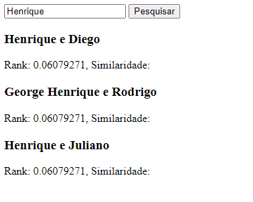
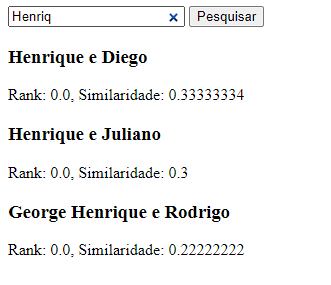

Algum tempo atrás vi o texto "A powerful full-text search in PostgreSQL in less than 20 lines" do Leandro Proença [1] e quis implementar algo assim pra projetos que não demandam o poder de um Apache Lucene ou de um Elastic Search.

<!-- truncate -->

O django já possui, em seu _core_, uma aplicação com métodos que são utilizados apenas com o **Postgres** e, para a minha surpresa, todos os conceitos de _full-text search_ já estavam disponíveis nesse _app_.

Restou, nesse caso, tentar reproduzir, por assim dizer, a _query_ do texto original utilizando o **ORM** do django e os métodos do _full-text search_.

Esse texto tem, por objetivo, trazer explicações sobre como essa implementação foi feita. Fundamentalmente, esse texto será uma versão explicada [dessa thread no twitter](https://twitter.com/goticodocalypso/status/1645248408066613248).

## Mostre-me o código

Todo o código-fonte do projeto está disponível no GitHub, [nesse repositório](https://github.com/EduardoJM/django-full-text-search).

> Disclaimer:
>
> O código da versão desse texto está disponível na branch [texto-1](https://github.com/EduardoJM/django-full-text-search/tree/texto-1).

---

## Adicionando configurações necessárias

Dentro do `settings.py` do projeto, precisamos adicionar a aplicação `django.contrib.postgres` dentro da variável de `INSTALLED_APPS` para que possamos utilizar as ferramentas do **django** próprias para o **Postgres**:

```python
# ...

INSTALLED_APPS = [
    'django.contrib.admin',
    'django.contrib.auth',
    'django.contrib.contenttypes',
    'django.contrib.sessions',
    'django.contrib.messages',
    'django.contrib.staticfiles',
    'django.contrib.postgres',
]

# ...
```

## Criando o model

Precisamos criar um _model_ para poder utilizar os conceitos da busca dentro dele. Para simplificar, esse caso, utilizamos um _model_ com um único campo de texto para as buscas:

```python
class Singer(models.Model):
    name = models.CharField("Cantor", max_length=150)

    def __str__(self):
        return self.name

    class Meta:
        verbose_name = "Cantor"
        verbose_name_plural = "Cantores"
```

## Criando uma view

Para testar os conceitos de _full-text search_, podemos criar uma _view_. Antes, é necessário dizer que nesse texto estou usando _views_ padrão do **django** com _templates_ em HTML para não adicionar mais complexidade lidando com o _Rest Framework_.

Podemos criar uma _view_ que recebe uma _query string_ para fazer a busca:

```python
from django.shortcuts import render
from .models import Singer

def search_singer(request):
    term = request.GET.get('q')
    if term:
        # TODO: fazer busca aqui
    else:
        singers = Singer.objects.order_by("-id").all()

    context = {
        'singers': singers,
        'term': term,
    }
    return render(request, "cantor.html", context)
```

O _template_ `cantor.html` que estou utilizando é bem simples apenas para permitir testes de forma mais fácil:

```html
<!DOCTYPE html>
<html lang="en">
  <head>
    <meta charset="UTF-8" />
    <meta http-equiv="X-UA-Compatible" content="IE=edge" />
    <meta name="viewport" content="width=device-width, initial-scale=1.0" />
    <title>Buscando Cantores</title>
  </head>
  <body>
    <div>
      <form action="">
        <input name="q"  value="{{ term }}"  />
        <button type="submit">Pesquisar</button>
      </form>
    </div>

    
    <main>
      
      <div>
        <h3>{{item.name}}</h3>
        
        <div>Rank: {{item.rank}}, Similaridade: {{item.similarity}}</div>
        
      </div>
      
    </main>
    
  </body>
</html>
```

## Full-Text Search

Precisamos, primeiro, criar um **SearchVector** (_ts_vector_) e um **SearchQuery** (_tsquery_). Assim:

```python
from django.contrib.postgres.search import SearchVector, SearchQuery

# ...

vector = SearchVector("name", config="portuguese")
query = SearchQuery(term, config="portuguese")

# ...
```

O vector é feito assim pra utilizar a coluna "name" do model **Singer**. A query é feita para processar a variável _term_ recebida no código da _view_ acima.

O próximo ponto é criar _annotations_ para fazer o _select_ de campos como o _to_tsvector_ e o _ts_rank_ (o método `.annotate` do _Django ORM_ faz o _select_ de outros campos e agrega eles a entidade):

```python
from django.contrib.postgres.search import SearchVector, SearchQuery, SearchRank

# ...

vector = SearchVector("name", config="portuguese")
query = SearchQuery(term, config="portuguese")
singers = Singer.objects.annotate(
    search=vector,
    rank=SearchRank(vector, query),
).filter(
    search=query
).order_by("-rank").all()

# ...
```

Adicionando o código dentro da view, passamos a ter:

```python
from django.shortcuts import render
from django.contrib.postgres.search import SearchVector, SearchQuery, SearchRank
from .models import Singer

def search_singer(request):
    term = request.GET.get('q')
    if term:
        vector = SearchVector("name", config="portuguese")
        query = SearchQuery(term, config="portuguese")
        singers = Singer.objects.annotate(
            search=vector,
            rank=SearchRank(vector, query),
        ).filter(
            search=query
        ).order_by("-rank").all()
    else:
        singers = Singer.objects.order_by("-id").all()

    context = {
        'singers': singers,
        'term': term,
    }
    return render(request, "cantor.html", context)
```

Utilizando um pequeno grupo de dados para teste:


Podeos testar e verificar que passamos a ter uma busca funcional:



Porém, ainda temos alguns problemas, pois, por exemplo, na busca por palavras incompletas, perdemos o ranqueamento:


Nesse ponto, entra a busca por similaridade que, combinada com o _Full-Text Search_ nos permitirá fazer uma busca mais funcional.

## Busca por Similaridade

Precisamos, primeiro, adicionar a extensão **pg_trgm** no banco de dados. Podemos fazer isso manualmente ou podemos criar uma _migration_ vazia e adicionar essa extensão na _migration_. Vou seguir pela segunda opção. Para a primeira, basta executar o comando no banco de dados:

```sql
CREATE EXTENSION pg_trgm
```

Para a segunda abordagem, podemos executar o comando `python manage.py makemigrations nome_do_app --empty` e ele criará uma -_migration_ vazia. A partir da _migration_ vazia, podemos adicionar o import ao CreateExtension e adicionar dentro de operations:

```python
from django.db import migrations
from django.contrib.postgres.operations import CreateExtension


class Migration(migrations.Migration):
    dependencies = [
        ('texto', '0003_alter_feat_music'),
    ]

    operations = [
        CreateExtension("pg_trgm")
    ]
```

Basta agora executar `python manage.py migrate` e teremos a extensão criada no banco de dados.

Agora, dentro da nossa busca, podemos fazer o uso do **TrigramSimilarity** para melhorar nossos resultados. Primeiro, vamos adicionar dentro do `.annotate`:

```python
from django.contrib.postgres.search import SearchVector, SearchQuery, SearchRank, TrigramSimilarity

# ...

singers = Singer.objects.annotate(
    search=vector,
    rank=SearchRank(vector, query),
    similarity=TrigramSimilarity("name", term),
)

# ...
```

Precisamos, também, alterar o `.filter` para utilizar de um operador lógico **OU**. Para isso, precisamos fazer uso do `Q(condição 1) | Q(condição 2)` do **django**:

```python
from django.contrib.postgres.search import SearchVector, SearchQuery, SearchRank, TrigramSimilarity
from django.db.models import Q

# ...

singers = Singer.objects.annotate(
    search=vector,
    rank=SearchRank(vector, query),
    similarity=TrigramSimilarity("name", term),
).filter(
    Q(search=query) | Q(similarity__gt=0)
).order_by("-rank", "-similarity").all()

# ...
```

Aqui, o que fazemos é adicionar o campo de _similarity_ na nossa _query_ e filtrar pra "o full-text search encontrou" ou "a similaridade é maior que zero". A partir desse momento, fazendo a mesma busca de um dos prints acima:



Por fim, nossa _view_ passa a ter o código:

```python
from django.shortcuts import render
from django.db.models import Q
from django.contrib.postgres.search import (
    SearchQuery,
    SearchRank,
    SearchVector,
    TrigramSimilarity,
)
from .models import Singer

def search_singer(request):
    term = request.GET.get('q')
    if term:
        vector = SearchVector("name", config="portuguese")
        query = SearchQuery(term, config="portuguese")
        singers = Singer.objects.annotate(
            search=vector,
            rank=SearchRank(vector, query),
            similarity=TrigramSimilarity("name", term),
        ).filter(
            Q(search=query) | Q(similarity__gt=0)
        ).order_by("-rank", "-similarity").all()
    else:
        singers = Singer.objects.order_by("-id").all()

    context = {
        'singers': singers,
        'term': term,
    }
    return render(request, "cantor.html", context)
```

É possível utilizar tanto o _rank_ ou o _similarity_ para cortar valores, conforme exemplos da documentação.

Por último, podemos adicionar um índice dentro do nosso _model_ para lidar com performance das queries:

```python
from django.db import models
from django.contrib.postgres.indexes import GinIndex
from django.contrib.postgres.search import SearchVector

class Singer(models.Model):
    name = models.CharField("Cantor", max_length=150)

    def __str__(self):
        return self.name

    class Meta:
        verbose_name = "Cantor"
        verbose_name_plural = "Cantores"
        indexes = [
            GinIndex(
                SearchVector("name", config="portuguese"),
                name="singer_search_vector_idx",
            )
        ]
```

---

Todo o código-fonte do projeto está disponível no GitHub, [nesse repositório](https://github.com/EduardoJM/django-full-text-search).

> Disclaimer:
>
> O código da versão desse texto está disponível na branch [texto-1](https://github.com/EduardoJM/django-full-text-search/tree/texto-1).

## Referências

1 - [A powerful full-text search in PostgreSQL in less than 20 lines
](https://leandronsp.com/a-powerful-full-text-search-in-postgresql-in-less-than-20-lines)

2 - [Full text search - Django Documentation](https://docs.djangoproject.com/en/4.2/ref/contrib/postgres/search/)

---

[Foto de capa por Mick Haupt no Unsplash](https://unsplash.com/pt-br/fotografias/eQ2Z9ay9Wws).
