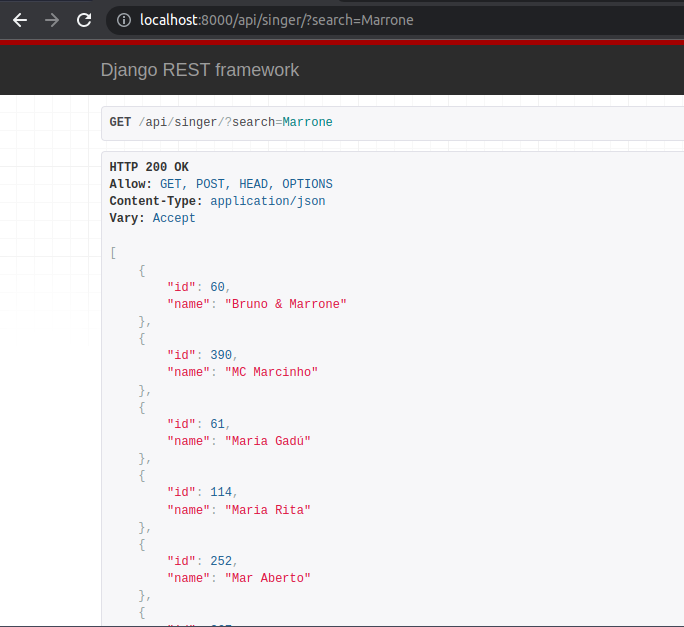
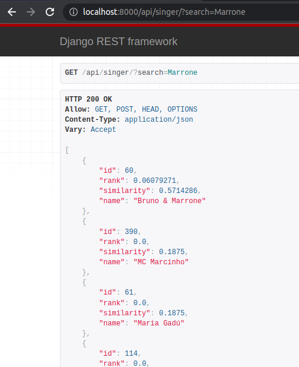
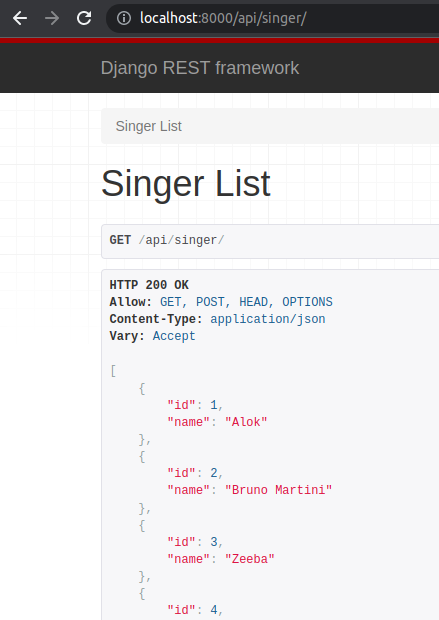

O texto `Full-Text Search: Implementando com Postgres e Django` [1] comenta sobre a implementação do sistema de _Full-Text Search_ do **Postgres**, trazido pelo Leandro Proença no texto `A powerful full-text search in PostgreSQL in less than 20 lines` [2], utilizando o **django**.

<!-- truncate -->

O projeto está no GitHub [3] e, para complementá-lo, esse texto tem por objetivo, construir um back-end de filtro, i.e. um _adapter_ de filtro, para lidar com o _full-text search_, como no algoritmo do texto anterior dentro do _rest-framework_.

Pra poder adicionar esse suporte, da melhor forma possível, podemos criar um _filter back-end_ customizado. São utilizados, como referência, o `SearchFilter` original do **django** [4] e [5].

---

## Mostre-me o código

O código desenvolvido nesse texto está disponível no repositório [django-full-text-search](https://github.com/EduardoJM/django-full-text-search) no Github.

> Disclaimer:
>
> O código da versão desse texto está disponível na branch [texto-2](https://github.com/EduardoJM/django-full-text-search/tree/texto-2).

---

## Implementando o BaseFilterBackend

Para criar o back-end de filtro, é preciso implementar a classe `rest_framework.filters.BaseFilterBackend`:

```python
from rest_framework.filters import BaseFilterBackend

class FullTextSearchFilter(BaseFilterBackend):
    pass
```

### Obtendo os parâmetros

Os primeiros métodos que serão implementados na classe acima são apenas métodos que buscam atributos na requisição, como o parâmetro `?search`, ou no `ModelViewSet` como, por exemplo, o `search_fields`. Esse código é bem parecido com o da referência em [5]:

```python
from rest_framework.filters import BaseFilterBackend
from rest_framework.settings import api_settings

class FullTextSearchFilter(BaseFilterBackend):
    search_param = api_settings.SEARCH_PARAM

    def get_config(self, view, request):
        return getattr(view, "search_config", None)

    def get_search_fields(self, view, request):
        return getattr(view, "search_fields", None)

    def get_similarity_threshold(self, view, request):
        return getattr(view, "similarity_threshold", 0)

    def get_search_term(self, request):
        params = request.query_params.get(self.search_param, '')
        params = params.replace('\x00', '')  # strip null characters
        params = params.replace(',', ' ')
        return params
```

### Fazendo a Busca

O método mais importante dessa classe é, sem dúvidas, o `filter_queryset` que é o método que faz as alterações em um `queryset` para devolver a resposta da API.

É preciso, antes de tudo, obter os parâmetros para fazer nossa busca, por meio dos métodos implementados acima:

```python
def filter_queryset(self, request, queryset, view):
    search_fields = self.get_search_fields(view, request)
    search_term = self.get_search_term(request)
    config = self.get_config(view, request)
    threshold = self.get_similarity_threshold(view, request)
```

Um primeiro ponto, que deve ser levado em consideração, é que, caso a variável `search_fields` ou a `search_term` não esteja preenchida, podemos retornar o `queryset` sem fazer alteração:

```python
def filter_queryset(self, request, queryset, view):
    # ...

    if not search_term or not search_fields:
        return queryset
```

O restante do método é bem parecido com o que já implementamos no texto anterior:

```python
def filter_queryset(self, request, queryset, view):
    # ...

    search_vector = SearchVector(*search_fields, config=config)
    search_query = SearchQuery(search_term, config=config)

    queryset = queryset.annotate(
        search=search_vector,
        rank=SearchRank(
            search_vector,
            search_query,
        ),
        similarity=TrigramSimilarity(*search_fields, search_term),
    ).filter(
        Q(search=search_query) | Q(similarity__gt=threshold)
    ).order_by("-rank", "-similarity")

    return queryset
```

Faz-se importante denotar que o `search_fields` aqui é usado como `*search_fields` para "desconstruir" o array. Assim, se `search_fields = ["name", "description"]`, a criação da instância `SearchVector` seria feita como `SearchVector("name", "description", config=config)`.

Por fim, a classe, completa, será:

```python
class FullTextSearchFilter(BaseFilterBackend):
    search_param = api_settings.SEARCH_PARAM

    def get_config(self, view, request):
        return getattr(view, "search_config", None)

    def get_search_fields(self, view, request):
        return getattr(view, "search_fields", None)

    def get_similarity_threshold(self, view, request):
        return getattr(view, "similarity_threshold", 0)

    def get_search_term(self, request):
        params = request.query_params.get(self.search_param, '')
        params = params.replace('\x00', '')  # strip null characters
        params = params.replace(',', ' ')
        return params

    def filter_queryset(self, request, queryset, view):
        search_fields = self.get_search_fields(view, request)
        search_term = self.get_search_term(request)
        config = self.get_config(view, request)
        threshold = self.get_similarity_threshold(view, request)

        if not search_term or not search_fields:
            return queryset

        search_vector = SearchVector(*search_fields, config=config)
        search_query = SearchQuery(search_term, config=config)

        queryset = queryset.annotate(
            search=search_vector,
            rank=SearchRank(
                search_vector,
                search_query,
            ),
            similarity=TrigramSimilarity(*search_fields, search_term),
        ).filter(
            Q(search=search_query) | Q(similarity__gt=threshold)
        ).order_by("-rank", "-similarity")

        return queryset
```

---

## Usando o FullTextSearchFilter

A classe `FullTextSearchFilter` pode ser utilizada nos `filter_backends` dos `ModelViewSet` do _django-rest-framework_. Simplificando:

```python
from rest_framework import serializers
from rest_framework.viewsets import ModelViewSet
from texto.models import Singer
from core.filters import FullTextSearchFilter

class SingerSerializer(serializers.ModelSerializer):
    class Meta:
        model = Singer
        fields = "__all__"

class SingerViewSet(ModelViewSet):
    queryset = Singer.objects.all()
    serializer_class = SingerSerializer
    filter_backends = [FullTextSearchFilter]
    search_config = "portuguese"
    search_fields = ["name"]
```

Ao registrar o `SingerViewSet` nas `urls` do projeto já é possível fazer chamadas para o _endpoint_ utilizando o `?search` como _full-text search_:

```python
from django.urls import path, include
from rest_framework.routers import SimpleRouter
from .viewsets import SingerViewSet

router = SimpleRouter()
router.register("singer", SingerViewSet, "Singer")

urlpatterns = [
    path('api/', include(router.urls))
]
```



---

## Mostrando o Rank e Similarity no retorno da API

É possível, inclusive, exibir os dados de `rank` e `similarity` no retorno da API. Como esses dados estão sendo anotados, i.e. acrescentados, na entidade, é possível, apenas, alterar o `ModelSerializer`:

```python
class SingerSerializer(serializers.ModelSerializer):
    rank = serializers.FloatField(read_only=True)
    similarity = serializers.FloatField(read_only=True)

    class Meta:
        model = Singer
        fields = "__all__"
```



### Mas, e sem a busca?

Acrescentar, apenas, o `rank` e `similarity` no `ModelSerializer` traz um problema: quando o _endpoint_ é chamado sem o `?search` os dados de `rank` e `similarity` não são retornados:



Isso pode ser resolvido, acrescentando, no construtor do FloatField, o parâmetro `default=0`:

```python
class SingerSerializer(serializers.ModelSerializer):
    rank = serializers.FloatField(read_only=True, default=0)
    similarity = serializers.FloatField(read_only=True, default=0)

    class Meta:
        model = Singer
        fields = "__all__"
```

---

## Filtrando por Similaridade

Por fim, para filtrar por similaridade, é possível definir a variável `similarity_threshold` no `ModelViewSet`:

```python
class SingerViewSet(ModelViewSet):
    queryset = Singer.objects.all()
    serializer_class = SingerSerializer
    filter_backends = [FullTextSearchFilter]
    search_config = "portuguese"
    search_fields = ["name"]
    similarity_threshold = 0.3
```


---

## Referências

[1] [Full-Text Search: Implementando com Postgres e Django](https://dev.to/eduardojm/full-text-search-implementando-com-postgres-e-django-kmf)

[2] [A powerful full-text search in PostgreSQL in less than 20 lines](https://leandronsp.com/a-powerful-full-text-search-in-postgresql-in-less-than-20-lines)

[3] [django-full-text-search](https://github.com/EduardoJM/django-full-text-search)

[4] [Filtering - SearchFilter](https://www.django-rest-framework.org/api-guide/filtering/#searchfilter)

[5] [rest_framework/filters.py](https://github.com/encode/django-rest-framework/blob/master/rest_framework/filters.py#L39)

---

[Foto de Capa por Douglas Lopes no Unsplash](https://unsplash.com/pt-br/fotografias/ehyV_XOZ4iA)
