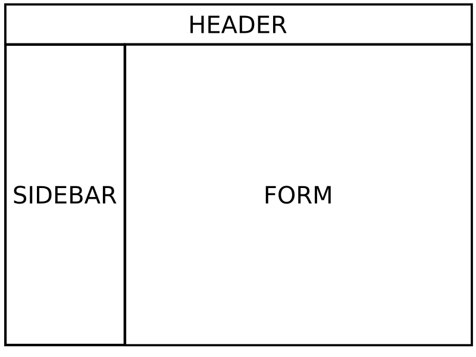

Já faz algum tempo que o **HTMX**, que me foi apresentado pelo [@JeffQuesado](https://twitter.com/JeffQuesado), me pareceu uma ideia muito legal para se trabalhar junto com Django, principalmente o **Django-Admin** que já tem uma estrutura fortemente baseada em _server-side_.

<!-- truncate -->

## Conteúdos <a name="contents"></a>

- [Conteúdos](#contents)
- [Introdução](#intro)
- [Contextualização da Plataforma Atual](#context)
- [Entendendo o Problema](#problem)
- [Por que HTMX se já usávamos React?](#why)
- [Questões técnicas](#tech)
- [Comunicação entre HTMX e React](#react)
- [Confirmação para execução de ações](#confirm)
- [Como é que isso ai funciona?](#how)
- [E o futuro?](#future)

## Introdução <a name="intro"></a>

Em uma demanda de um dos projetos em que atuo, precisávamos de uma funcionalidade para a qual o uso do **HTMX** se encaixaria perfeitamente e esse texto tem como objetivo levantar questões pelas quais foi decidido o uso do **HTMX** e não de outras ferramentas e elucidar como foram feitas integrações entre **Django**, **HTMX** e **React** para construir ferramentas reais.

> O título é uma inspiração de um _tweet_ que vi, alguns dias atrás, que questionava se alguém estava utilizando o **HTMX** para algo mais além de criar TODO-Lists.

## Contextualização da Plataforma Atual <a name="context"></a>

O back-end do projeto utiliza o **Django** com **Django-Rest-Framework** para servir uma API de integração para um app mobile e, para gerenciamento dos conteúdos, o **Django-Admin** é utilizado.

O django-admin possuí, nas páginas de formulário, uma estrutura parecida com a seguinte: um cabeçalho ocupado toda a largura da página, e logo a baixo uma sidebar e o conteúdo principal, que no caso é um formulário.



Em alguns formulários, a estrutura e arquitetura de informação dos _models_ demandava um controle de carregamento e de exibição de itens complexo usando _lazy-loading_. Desse modo, quando o ferramental do **django** e do **django-admin** deixou de suprir as necessidades, parte desses formulários foi construída utilizando aplicações pequenas com **React**.

Essas aplicações **React** que eram carregadas apenas em páginas específicas não demandavam, por exemplo, o uso de _routers_ e coisas do tipo.

## Entendendo o Problema <a name="problem"></a>

O painel de administração é utilizado para algo próximo a um CMS (_content management system_) para um app de idiomas. Durante a criação de algumas "entidades" dentro da plataforma, seria necessário uma ferramenta, em _popup_, para consultar as "entidades" já cadastradas, pois esse processo atualmente era gerenciado com planilhas externas, aumentando a complexidade no uso do painel.

Essa mesma ferramenta deveria, também, fornecer a opção de clonar entidades para a página em que se estava trabalhando (alternado a entidade paí/chave estrangeira).

## Por que HTMX se já usávamos React? <a name="why"></a>

Quando começamos a avaliar a funcionalidade, a primeira discussão foi: será que o **HTMX** se encaixa bem aqui? ou será melhor lidar com **React**?

Um dos principais pontos levados em consideração: a estrutura do **django** e do **django-admin** já trazia uma quantidade enorme de código e funcionalidades que poderiam ser reutilizadas para a exibição, como paginação, etc. na aplicação **react** que roda nessa aplicação não lidava com paginação nem com diversas outras coisas que demandaria muito mais tempo para implementar que utilizando partes dos _templates_ do **django-admin** adaptados.

Como essa funcionalidade não seria, sempre, inserida nas mesmas páginas que o formulário **react**, haveria muito trabalho pra conciliar o uso do **react**, **bundlers**, etc.

Esse conjunto de fatores foram os principais motivantes para a adoção do **HTMX**, que diferente do **react** que teriamos que lidar com **bundler**, só importamos o script onde fosse necessário utilizar as tags do **HTMX**.

> A simplicidade que o **HTMX** trouxe para essa implementação, talvez tivesse sido utilizada no lugar do **react** se a conhecêssemos na época.

## Questões técnicas <a name="tech"></a>

Algumas questões que foram foco dos esforços no trabalho com essa funcionalidade serão tratadas nessa seção. Essas questões não foram, necessariamente, complexas ou problemáticas. São apenas pontos aos quais gostaria de comentar.

### Comunicação entre HTMX e React <a name="react"></a>

Como comentado, em algum lugar no texto acima, era necessário clonar itens para o formulário atual. Formulário esse, construído em **React**. Assim, ao integrar uma ação para clonar o item, utilizando o `hx-post`, é necessário que algum _trigger_ seja disparado para que alguma parte da app **React** possa processar.

> Um detalhe, ao qual não vou adentrar aqui, é que esses "links" para ações estão dentro de um formulário, então na chamada para o `hx-post` todos os campos do formulário também são enviados.

```html
<span
  hx-post="/admin/my-action"
  hx-trigger="confirmed"
  hx-indicator=".htmx-indicator"
  title="Clonar"
>
  ...
</span>
```

O `hx-trigger="confirmed"` se deve a seção abaixo, onde tratamos sobre a confirmação para a execução da ação. Fora isso, no lado do servidor, utilizando `django-htmx` podemos inserir uma header `HX-Trigger` para disparar um _trigger_ quando a ação do **HTMX** for finalizada:

```python
def my_view(request):
    ...
    response = render(request, 'my_template.html', my_context)
    resp.headers['HX-Trigger'] = 'completeClone'
    return resp
```

Dentro do cliente **react** podemos adicionar o evento ao `document` devido ao event bubbling:

```tsx
useEffect(() => {
  const fetch = async () => {
    ...
  }

  document.addEventListener('completeClone', fetch);
  return () => {
    document.removeEventListener('completeClone', fetch);
  }
}, []);
```

### Confirmação para execução de ações <a name="confirm"></a>

Para exibir confirmações de execução das ações, utilizamos a biblioteca SweetAlert2, que já estava no projeto pra ser utilizada em alguns outros momentos:

```javascript
function confirmClone(element, title) {
  text =
    'Deseja clonar o item <strong>"' +
    title +
    '"</strong>? Essa ação não poderá ser desfeita!';
  Swal.fire({
    title: 'Tem certeza?',
    html: text,
    showCancelButton: true,
    confirmButtonText: 'Sim, Clonar',
    cancelButtonText: 'Cancelar',
  }).then(function (result) {
    if (!result.isConfirmed) {
      return;
    }
    htmx.trigger(element, 'confirmed');
  });
}
```

A linha `htmx.trigger(element, 'confirmed');` dispara o _trigger_ que está no `hx-trigger="confirmed"` do `span`. Aqui é preciso completar, também, a tag:

```html
<span
  hx-post="/admin/my-action"
  hx-trigger="confirmed"
  hx-indicator=".htmx-indicator"
  onclick="confirmClone(this, 'título do item!!!!')"
  title="Clonar"
>
  ...
</span>
```

### Como é que isso ai funciona? <a name="how"></a>

A implementação com **HTMX** fluiu muito bem, mas em diversos momentos foi necessária muita experimentação por falta de clareza do que, exatamente, os comandos fazem ou como lidar para que eles fizessem exatamente o que queria.

Mas, esse pode ser uma _skill issue_ do prazo e de ser a primeira vez utilizando a documentação, tanto que as duas seções acima foram fortemente baseadas pelos seus exemplos (mas não pela sua documentação).

## E o futuro? <a name="future"></a>

Bom, desenvolver uma funcionalidade real com **HTMX** foi uma experiência muito boa e creio que o projeto tem muito potêncial, apesar que em diversos momentos, a depender da estrutura e do tamanho do projeto, eu continue achando que uma API (Rest ou _intent based_) com um cliente front-end ainda seja mais simples de se manipular.

Ainda assim, espero ter mais chances de usar o **HTMX** integrado ao **django-admin** que é, fundamentalmente, **server-side**.
