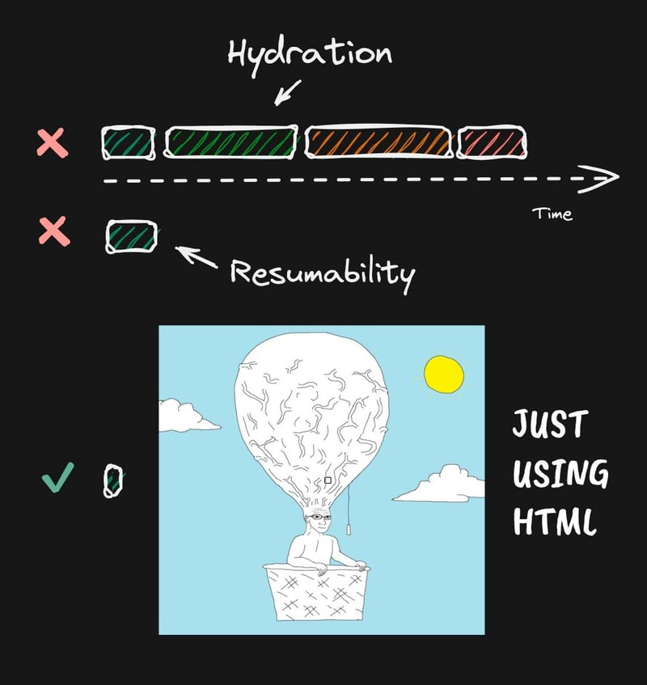

Nos últimos dias surgiram diversos tweets com opiniões, indicações, ou pedindo textos de referência sobre o uso do HTMX. Optei pelo uso do HTMX em alguns projetos, inclusive em produção, e pela falta de conteúdos mostrando usos reais da biblioteca, decidi começar a escrever. Esse texto, em específico, nasceu de alguns desses questionamentos do twitter.

<!-- truncate -->

## Conteúdos <a name="content" />

- [Conteúdos](#content)
- [Introdução](#intro)
- [O que é o HTMX?](#o-que-e)
- [Contexto e Motivos pela escolha](#context)
  - [1. Template Engine](#template-engine)
  - [2. Django-Admin](#django-admin)
  - [3. Autenticação e Permissão](#auth)
  - [4. Funcionalidades do Django](#features)
  - [5. Escopo](#scope)
- [Alguns contrapontos](#points)
- [Quer dizer, então, que agora eu só uso HTMX?](#end)

## Introdução <a name="intro" />

Esse texto foi inspirado por uma publicação do Mario Souto ([omariosouto](https://x.com/omariosouto)) no twitter ao questionar sobre a quantidade de gente indicando HTMX recentemente e se essas pessoas estavam usando HTMX em produção.

O tweet pode ser visto abaixo:

Tenho trabalhado com HTMX (Django + HTMX, pra especificar a stack), inclusive em produção (Veja o texto [Django, Htmx e React: usando HTMX para além de TODO-Lists](https://dev.to/eduardojm/django-htmx-e-react-usando-htmx-para-alem-de-todo-lists-3amo)) e resolvi escrever esse texto para elucidar o contexto e os motivos que me levaram a decisão de usá-lo.

## O que é o HTMX? <a name="o-que-e" />

> htmx gives you access to AJAX, CSS Transitions, WebSockets and Server Sent Events directly in HTML, using attributes, so you can build modern user interfaces with the simplicity and power of hypertext
>
> Home do [htmx.org](https://htmx.org/)

Resumidamente, o HTMX é uma biblioteca JavaScript que permite que você use transições, faça requisições e coisas do tipo utilizando atributos HTML para construir interfaces modernas utilizando HTML (principalmente em servidores que renderizam HTML, como é o caso do Django).

## Contexto e Motivos pela escolha <a name="context" />

### 1. Template Engine <a name="template-engine" />

O Django é, por padrão, um framework que implementa um sistema de templates que devolve HTML para o navegador. Junto com o sistema de templates, existe um sistema de gerenciamento de arquivos estáticos.

Esse primeiro contexto é importante aqui pois ao utilizar a stack Django + HTMX, não é necessário implementar, adaptar ou configurar nenhum sistema de templates.

### 2. Django-Admin <a name="django-admin" />

O [Django-Admin](https://docs.djangoproject.com/en/5.0/ref/contrib/admin/) é uma aplicação (ou um módulo, por assim chamar), incluída junto a distribuição django e que fornece uma interface de administração fácil de ser utilizada para gerenciar os **models** criados dentro dos projetos.

A partir do item anterior, já é possível imaginar que o Django-Admin usa, fundamentalmente, templates HTML e renderização server-side (que devolve o HTML).

Em alguns casos, quando há a necessidade de alguma funcionalidade com maior dinamização dentro do django-admin é mais factível e rápido usar uma biblioteca que faça a ponte para o mesmo sistema de templates HTML que utilizar um framework ou biblioteca front-end, como o React.

### 3. Autenticação e Permissão <a name="auth" />

Assim como o conjunto de utilitários para o painel administrativo, o django traz por padrão um sistema de autenticação e permissões configurável e utilizar o HTMX remove a necessidade de inserir outros tipos de autenticação (como JWT amplamente usada para API's).

> Outro ponto relevante sobre a autenticação e permissão é que ao utilizar o Django-Admin e uma aplicação Django padrão server-side, a autenticação entre ambiente de admin e aplicação é compartilhada de forma simples, já que, na prática, é o mesmo site.

### 4. Funcionalidades do Django <a name="features" />

O Django possui facilitadores como sistema de formulários e widgets que se integram muito bem com a Template Engine e facilitam coisas como validar os dados e, consequentemente, armazenar no banco de dados.

### 5. Escopo <a name="scope" />

Tudo o que descrevi acima foi bastante decisivo para a escolha do HTMX, mas, talvez, o que tenha sido mais decisivo foram os escopos das aplicações e funcionalidades onde o HTMX foi utilizado. São escopos onde os formulários são simples, não exigiam muitas manipulações ou validações. Não existem formulários com muita complexidade (por exemplo, um formulário de cadastro de cliente onde você pode adicionar vários dependentes no cadastro, etc.).

> Mesmo que na maioria dos formulários complexos eu considere como falha de decisões, nem sempre essas decisões são dos devs.

Dados os motivos acima, ter conhecimento do framework de back-end / server-side ao qual se vai trabalhar, aliado ao HTMX, é importante para decidir se os requisitos dos formulários e outras necessidades podem, ou não, se tornar empecilhos.

## Alguns contrapontos <a name="points" />

Nem tudo são flores.

Em algumas situações é difícil fazer o que se quer fazer com a biblioteca, principalmente pela baixa quantidade, atualmente, de conteúdos.

Assim como em framework's front-end, como o react, lidar com redirecionamento de URL's pode ser bastante complexo, por exemplo pra preservar filtros em requisições via HTMX.

> Existem algumas complexidades com que eu preciso lidar que eu, no atual momento, não transfiro essa responsabilidade ao HTMX e, portanto, não irei listá-las aqui.

## Quer dizer, então, que agora eu só uso HTMX? <a name="end" />

Bem, não. Por mais que eu tenha gostado bastante do desenvolvimento com o HTMX integrado ao Django, uso em poucos projetos e, na maioria das vezes, não é a única forma de dinamização das páginas (em alguns casos é preciso utilizar bastante JavaScript Vanilla ou outras bibliotecas como o React).

Além disso, algumas aplicações com as quais trabalho continuam sendo feitas com API's Rest usando JSON e front-end's como SPA's.

Tudo depende da análise dos pontos listados acima e de contextos das necessidades do negócio, se o projeto já está em andamento, se existe time, se é um projeto que farei sozinho como freelancer, dentre outras questões.
