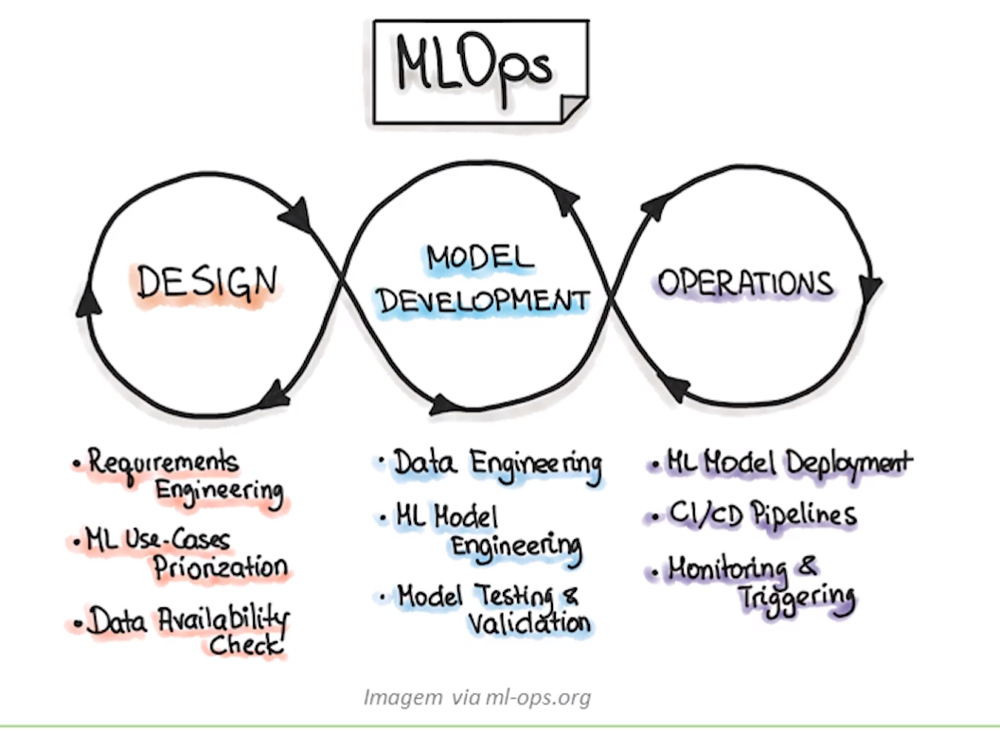

# MLOps

Em MLOps, o foco é evitar "débito técnico" em aplicações de ML. Uma experiência de MLOps ideal é aquela em que os **ativos de Machine Learning são tratados de forma consistente com todos os outros ativos de software** em um ambiente de CI/CD.

## Fases de MLOps

### Fase 1: Design

É dedicada ao entendimento do negócio, dados e software.

- Identifica-se o **usuário em potencial, projetamos a solução de aprendizado de máquina** para rer seu problema e **avaliamos o desenvolvimento do projeto**;

- Atua-se dentro de duas categorias de problemas:
  - aumentando a produtividade do usuário;
  - aumentando a interatividade de nossa aplicação.

- Inicialmente, define-se os **casos de uso de ML** e os **priorizamos**. A melhor prática é trabalhar em um caso de uso de ML por vez.

- A fase visa inspecionar os **dados disponíveis** que serão necessários para treinar o modelo e **especificar os requisitos funcionais** e **não funcionais**.

- Deve-se usar esses requisitos para **projetar a arquitetura do aplicativo de ML** e **criar um conjunto de testes**.

### Fase 2 - Desenvolvimento do Modelo

- Essa fase é dedicada a **verificar a aplicabilidade do ML** para o problema, POCs de ML;

- Executa-se, **etapas iterativamente diferentes**, como identificar ou melhorar o algoritmo de ML adequado, engenharia de dados e/ou modelos;

- O objetivo principal nessa fase é **fornecer um modelo de ML de qualidade estável** que será executado em produção.

### Fase 3 - Operação

- O foco: **entregar o modelo de ML em produção usando práticas de DevOps**;
- Todas as três fases estão interligadas e influenciam umas às outras;
- Uma **decisão de design** se propaga para a **fase de experimentação** e, finalmente, influenciará as opções de implantação durante a fase final;
- Exemplo: escolha de framework para desenvolvimento.

## Princípios de MLOps

### Automação

**O nível de automação das pipelines determina a maturidade do processo de ML**. Com o aumento da maturidade, aumento de velocidade;

- O objetivo de uma equipe de MLOps é **automatizar a implantação de modelos de ML**;

- Pode ser usado diversos **gatilhos para treinamento e implantação** do modelo.

- O teste automatizado ajuda a **descobrir problemas rapidamente**;

- Permite a **correção rápida** de erros;

- Para adotar o MLOps, vemos três níveis de automação:
  - Treinamento e implantação manual do modelo;
  - Execução automática de pipelines de ML (treino);
  - Pipelines de CI/CD.

### Continuous X

- Ativos de ML = **modelo** + **parâmetros** + ** hiperparâmetros** + **scripts de treinamento** + **dados de treinamento/teste**;
- Um serviço de implantação fornece **orquestração**, **registro**, **monitoramento** e **notificação** para garantir que os modelos de ML, o código e os artefatos de dados sejam estáveis.

- **Integração Contínua (CI)**: estende o código e os componentes de teste e validação, adicionando dados e modelos de teste e validação.
- **Entrega Contínua (CD)**: se preocupa com a entrega de uma pipeline de treinamento de ML que implanta automaticamente outro serviço de previsão do modelo de ML.
- **Treinamento Contínuo (CT)**: é exclusivo da propriedade de sistemas de ML, que retreina automaticamente os modelos de ML para reimplantação.
- **Monitoramento Contínuo (CM)**: se preocupa com o monitoramento de dados de produção e métricas de desempenho do modelo, que estão vinculados às métricas de negócios.

### Treinamento Contínuo

- É a busca por treinar um modelo de ML automaticamente;
- Podem ter gatilhos para iniciar o treino:
  - Atualização no código;
  - Atualização no dado;
  - Ocorrência de um intervalo de tempo;
  - Disparo manual.

- Nesses casos, para aumentar a automação, usa-se AutoML;

- O sucesso depende crucialmente de especialistas em ML para executar as seguintes tarefas:

  - Pré-processamento e limpeza dos dados;
  - Seleção e construção de features apropriadas;
  - Seleção de uma família de modelos apropriada;
  - Otimização dos hiperparâmetros do modelo;
  - Analisar criticamente os resultados obtidos.

### Versionamento

- O objetivo é tratar **scripts de treinamento de ML**, **modelos de ML** e **conjuntos de dados** como foco nos **processos de DevOps**;

- Neste caso, usa-se controle de versão;

- Alguns dos motivos são os seguintes:
    - Treinamento em novos datasets;
    - Treinamento com novas abordagens.
    - Os modelos podem se degradar com o tempo;
    - Os modelos podem ser rapidamente revertidos para uma versão anterior;
    - A conformidade corporativa ou governamental pode exigir auditoria;
    - Os dados podem residir em vários sistemas;
    - Os dados só podem residir em juridições restritas.

- Analogamente às melhores práticas para desenvolver sistemas de software confiáveis, **toda especificação de modelo de ML** (código de treinamento) deve passar por uma fase de revisão de código.

- Além disso, **cada especificação de modelo de ML deve ser versionada** para tornar o treinamento de modelos de ML auditável e reprodutível.

### Rastreio de Experimentos

- Processo **altamente iterativo** e centrado em pesquisa;

- Contrasta com o processo tradicional de desenvolvimento de software;

- Em ML, vários **experimentos de treinamento** de modelos podem ser executados em **paralelo** antes de tomar a decisão de qual modelo será promovido para produção.

### Testes

- A pipeline completa inclui três componentes:
    - Dados;
    - Modelo de ML;
    - Aplicação;

- Três escopos para testes em sistemas de ML:
    - Recursos e dados;
    - Desenvolvimento de modelos;
    - Infraestrutura de ML.

### Monitoramento

- Depois que o modelo de ML for implantado, ele precisa ser monitorado para garantir que funcione conforme o esperado.

- Monitore as alterações de dependência ao longo de todo o pipeline resultando em notificação.

    - Alteração da versão dos dados;
    - Alterações no sistema de origem;
    - Atualização de dependências;

- Monitore **mudanças nos dados**: criar alarmes se os dados não corresponderem ao esquema, que foi especificado na etapa de treinamento.

- Monitore a **estabilidade numérica** do modelo ML (ocorrências de NaNs ou Infinity).

- Monitore o **desempenho computacional** de um sistema de ML (CPU, GPU e RAM).

- Monitore a **degradação da qualidade preditiva** do modelo de ML nos dados servidos.

### Reprodutibilidade

Ideia principal:

- Significa que todas as fases do processamento de dados, treinamento do modelo de ML e implantação do modelo de ML **devem produzir resultados idênticos com a mesma entrada**.

- Se temos os mesmos dados, mesmos modelos, mesmas configurações e mesmos ambientes, temos de **ser capazes de produzir os mesmos artefatos**.
