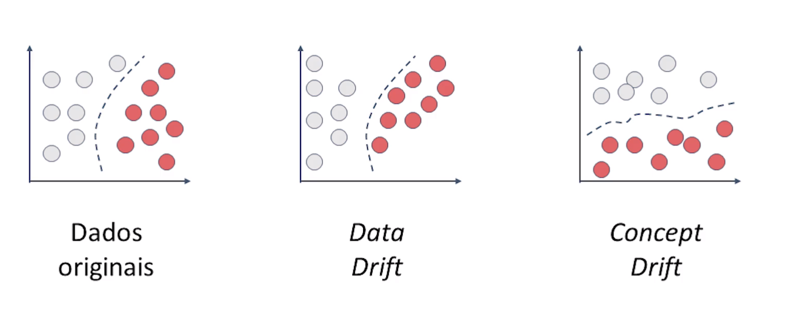

# Data Drift e Concept Drift

Data drift é um fenômeno em que os dados usados para treinar um modelo de ML mudam com o tempo.

> data drift = detecção de diferença.

Diferenças entre data drift e concept drift:

- **Data drift**: mudança na distribuição dos dados;
- **Concept drift**: mudança na relação entre os dados e a variável alvo;
- **Resolução**: O data drift pode ser resolvido atualizando os dados do modelo. O concept drift pode ser resolvido refazendo o modelo.

Dicas para lidar com o data drift e o concept drift:

- **Monitore os dados**: monitorar os dados usados para treinar os modelos para detectar sinais de drift.
- **Atualize os dados regularmente**: Os modelos devem ser atualizados regularmente com novos dados;
- **Refaça os modelos**: Se o concept drift for severo, o modelo pode precisar ser refeito completamente.

