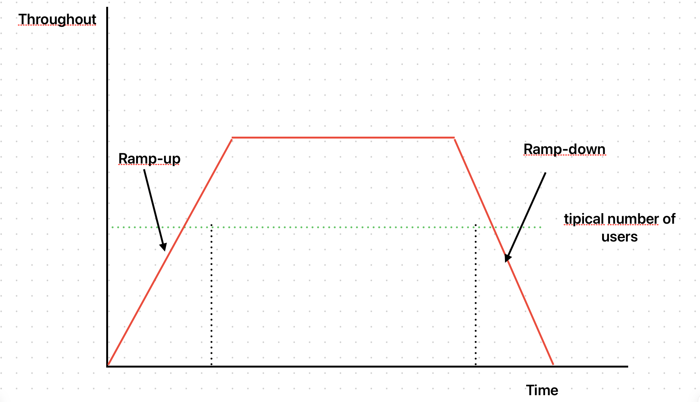

# Teste de Estresse



## Objetivos

- Adicionar mais carga do que o normal.
- Testa como o sistema se comporta sobre pressão.

## Testando com o k6

Fundamentalmente, o teste de estresse e o teste de carga, em termos de implementação para o k6 são iguais, o que diferencia eles é a determinação do que é considerado a carga esperada pelo seu sistema:

```javascript
import http from 'k6/http';
import { sleep } from 'k6';

export const options = {
  stages: [
    {
      duration: '10s',
      target: 200,
    },
    {
      duration: '30s',
      target: 200,
    },
    {
      duration: '10s',
      target: 0,
    },
  ],
};

export default function () {
  http.get('http://192.168.68.108:3000');
  sleep(1);
}
```

## Referências

- [Tipos de teste de carga](https://eltonminetto.dev/post/2024-01-05-load-test-types/)
- [Teste de carga usando o k6](https://eltonminetto.dev/post/2024-01-11-load-test-k6/)
