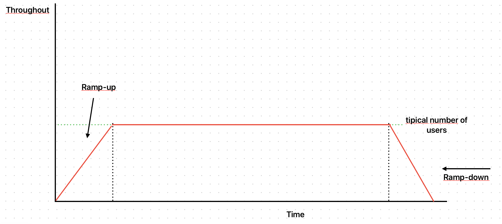

# Teste de imersão

:::info Outros nomes
Também é conhecida com **"endurance testing"**, **"capacity testing"** ou **"longevity testing"**.
:::



## Objetivos

- Testar como o sistema se comporta sob carga constante por um longo período de tempo.
- Ajudar a identificar _memory leaks_, ou como o sistema se comporta com a exaustão de alguns recursos como memória, disco e banco de dados.

## Testando com o k6

O teste de imersão e o teste de carga, em termos de implementação para o k6 são iguais, o que diferencia eles é o tempo configurado para cada stage e a quantidade de usuários:

```javascript
import http from 'k6/http';
import { sleep } from 'k6';

export const options = {
  stages: [
    {
      duration: '5m',
      target: 1000,
    },
    {
      duration: '24h',
      target: 1000,
    },
    {
      duration: '5m',
      target: 0,
    },
  ],
};

export default function () {
  http.get('http://192.168.68.108:3000');
  sleep(1);
}
```

Assim como o teste de ponto de interrupção, é necessário observabilidade para conseguir identificar problemas que acontecem durante o teste.

## Referências

- [Tipos de teste de carga](https://eltonminetto.dev/post/2024-01-05-load-test-types/)
- [Teste de carga usando o k6](https://eltonminetto.dev/post/2024-01-11-load-test-k6/)
