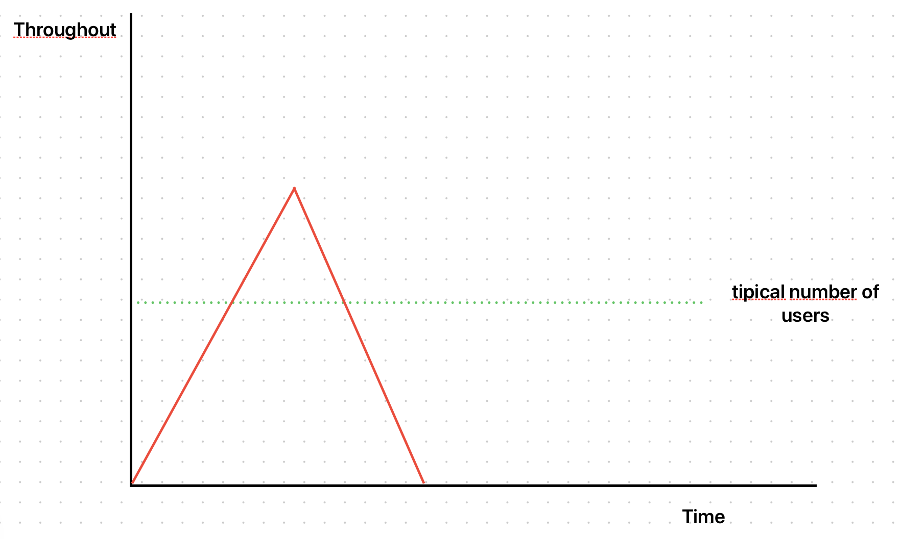

# Teste de Pico



## Objetivos

- Adicionar um pico de carga para observar como o sistema se comporta nesses cenários.

## Como testar

Para testar esse caso, aumentamos, de forma instantânea, o número de acessos. Esse número deve diminuir na mesma velocidade.

## Testando com o k6

```javascript
import http from 'k6/http';
import { sleep } from 'k6';

export const options = {
  stages: [
    {
      duration: '1m',
      target: 10000,
    },
    {
      duration: '30s',
      target: 0,
    },
  ],
};

export default function () {
  http.get('http://192.168.68.108:3000');
  sleep(1);
}
```

Podem acontecer falhas e degradação do desempenho e, dessa forma, os resultados do teste do k6 podem fornecer insights se a porcentagem de falhas e a performance que caiu são aceitáveis para esse caso ou não.
