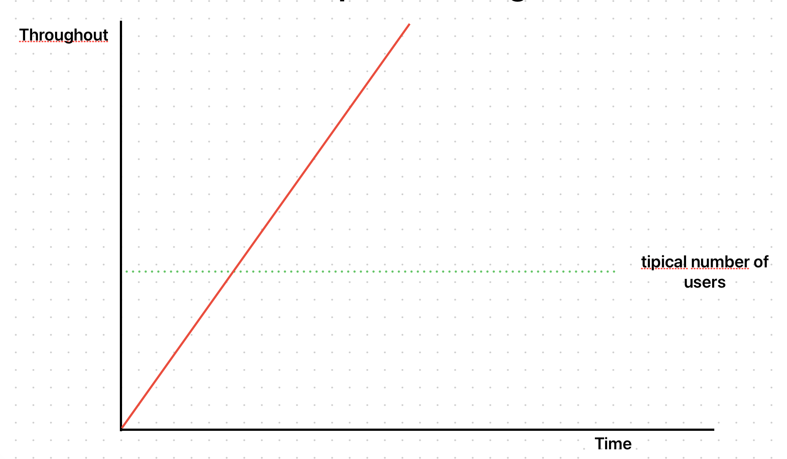

# Teste de ponto de interrupção



## Objetivos

- Forçar uma carga no sistema até ele quebrar.
- Identificar qual é o ponto de ruptura do ambiente.

## Testando com o k6

```javascript
import http from 'k6/http';
import { sleep } from 'k6';

export const options = {
  stages: [
    {
      duration: '2h',
      target: 100000,
    },
  ],
};

export default function () {
  http.get('http://192.168.68.108:3000');
  sleep(1);
}
```

## Analisando

Para analisar, de melhor forma possível, é necessário fazer o uso de observabilidade. Somente com os dados dos testes do k6 ficará difícil encontrar os problemas.

É preciso analisar como o servidor e aplicação se comportam para entender quando ela para de responder. Isso permite identificar gargalos e pontos de ruptura do sistema.

## Referências

- [Tipos de teste de carga](https://eltonminetto.dev/post/2024-01-05-load-test-types/)
- [Teste de carga usando o k6](https://eltonminetto.dev/post/2024-01-11-load-test-k6/)
