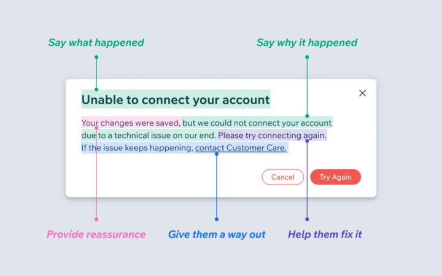
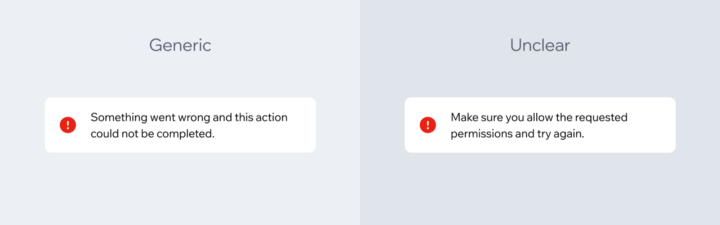

# Tratamento de Erros

Toda vez que um servidor cai, não temos internet, ou esquecemos de preencher alguma informação num formulário, recebemos uma mensagem de erro. "Algo está errado" é o mais clássico. Mas, o que está errado? O que aconteceu? E o mais importante, como eu posso corrigir isso?

## O que faz uma mensagem de erro ser ruim?

A imagem a seguir ([fonte](https://wix-ux.com/when-life-gives-you-lemons-write-better-error-messages-46c5223e1a2f)) ilustra a estrutura de uma mensagem de erro ruim.

### Tom inapropriado

Imagine um médico fazendo uma operação e de repente falando "Oops! Algo está errado!". Seja numa operação médica ou seja em se tratando da fonte de renda de alguém. Essa não é a hora de ser engraçado ou fofo. É preciso mostrar para o usuário que sabemos que é sério e entendemos que é importante para eles.

### Jargões técnicos

Não foi possível fazer "fetch" dos dados? Minhas credenciais foram negadas? Mensagens técnicas não importante. O usuário só quer saber o que deu errado e como consertar.

### Passando a culpa

O foco deve ser no problema e não na ação que levou ao problema. O usuário não deve ser envergonhado pela mensagem de erro, mesmo que o que eles tenham feito seja o motivo pela qual a mensagem de erro foi exibida.

Também não deve ser tentado transferir a culpa/responsabilidade para terceiros. Os usuários não querem pensar em outras plataformas (por exemplo, o meio de pagamentos usado em uma aplicação).

### Erros Genéricos Sem Motivo

Às vezes não sabemos o que causou o erro. Mas quando sabemos o que causou o erro, devemos contar aos usuários.

## O que faz uma mensagem de erro ser boa?

A imagem a seguir ([fonte](https://wix-ux.com/when-life-gives-you-lemons-write-better-error-messages-46c5223e1a2f)) ilustra a estrutura de uma boa mensagem de erro.

### Diga o que aconteceu e o motivo

Deixe bem claro o que aconteceu ou não. Explique o motivo pelo qual o usuário recebeu esse erro, mesmo que a única explicação seja "Houve um problema técnico". Nesses casos, pode ser bom dizer que foi um problema "nosso" para que o usuário saiba que o erro não foi dele.

### Forneça garantias

Quando for possível, forneça garantias de que algo não foi afetado (por exemplo, quando os dados foram salvos como rascunho antes do erro).

### Seja empático

Por mais que não queiramos nos desculpar demais, é preciso ser empático. Pode-se utilizar, por exemplo, palavras como "Por favor", mesmo que seja uma situação terrível para ser empático com o usuário.

### Ajude o usuário a resolver

Diga ao usuário, exatamente, o que ele precisa fazer para corrigir o erro (se houver como). Se tiver pouco espaço, envie-os para artigos ou textos explicando como eles podem resolver esse problema.

### Sempre dê uma saída

Se eles não conseguirem resolver o problema, ou se for possível que o problema continue acontecendo, forneça a eles uma maneira de entrarem em contato com o Atendimento ao Cliente.

## Estratégias para lidar com o problema

Procurar por todas as mensagens de erros. Ir de mensagem em mensagem, uma por uma e mapear onde elas estão sendo ativadas no código. Entender o que faz a mensagem ser exibida, quão frequente elas estão acontecendo e o que pode ser feito para resolver o problema.

Em alguns casos, pode ser só alteração do conteúdo da mensagem de erro. Em outros casos é preciso repensar a estrutura da mensagem de erro. Em alguns outros casos pode ser necessário alterar o código para resolver problemas por baixo dos panos para evitar que tais erros aconteçam.

## Pontos importantes

### Mensagens genéricas e mensagens não claras

Existe uma diferença entre uma mensagem genérica e uma mensagem que não está clara, apesar que ambas dependem do mesmo tipo de atenção e prestam o mesmo desserviço. Por exemplo, na imagem abaixo ([fonte](https://wix-ux.com/when-life-gives-you-lemons-write-better-error-messages-46c5223e1a2f)), a mensagem genérica não informa nenhuma informação enquanto que a mensagem que não está clara exibe informações que, na prática, não servem pra nada.

### Um problema de diversas pessoas

Erros genéricos podem ser vistos como erro de design, desenvolvimento e produto. Para corrigir essas mensagens é preciso de trabalho do time de desenvolvimento para mapear os erros, entender o motivo e o que está acontecendo por baixo dos panos. Gerente de Produtos devem priorizar e criar tarefas. Designers devem lidar com novos fluxos e mensagens de erros. UX Writers devem reescrever diversas mensagens de erros. 

Do ponto de vista de fluxo de desenvolvimento é importante, sempre que for utilizar uma mensagem genérica pensar o motivo pela qual ela será exibida, se é algo corriqueiro, etc.

## Referências

NADLER, Jenni. When life gives you lemons, write better error messages. 2022. Disponível em: https://wix-ux.com/when-life-gives-you-lemons-write-better-error-messages-46c5223e1a2f. Acesso em: 6 dez. 2022.
