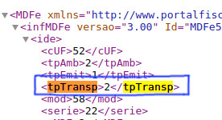
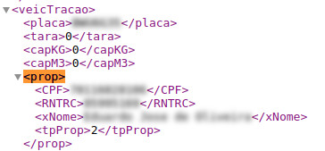
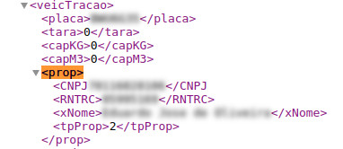

# Tipo de Transportador

O campo `<tpTransp>` (`MDFe/infMDFe/ide/tpTransp`) indica o tipo de transportador. Esse campo pode receber três valores de um enumerador. Olhando em algum dicionário de dados (como o disponibilizado no próprio portal do MDF-e) ([referência](https://dfe-portal.svrs.rs.gov.br/Mdfe/Documentos)) teremos a seguinte listagem (aqui foram agregadas descrições retiradas de [referência](https://ajuda.tryideas.com.br/books/documentos-fiscais/page/tipo-de-transportador-etc---tac---ctc)):

| Valor      | Nome      | Descrição                             |
| ---------- | --------- | ------------------------------------- |
| 1          | ETC       | **Empresa de Transporte de Cargas**: toda empresa que disponha de veículos que são empregados no transporte de mercadorias e bens (próprios ou cargas de terceiros); |
| 2          | TAC       | **Transportador Autônomo de Cargas**: obrigatório para todo e qualquer tipo de autônomo, desde operadores de pequenos caminhões que operam em cidades, até caminhoneiros que dirigem grandes distâncias. Prestando seus serviços para pequenas, médias e grandes transportadoras. |
| 3          | CTC       | **Cooperativa de Transporte de Cargas**: inclui as cooperativas e uniões de condutores que operam no mercado de transporte de mercadorias. |

Veja, na imagem abaixo, um exemplo na estrutura de um XML.



O preenchimento desse campo de "forma errada" pode causar alguns problemas relacionados aos dados do proprietário do veículo de tração. Temos algumas opções:

## Casos

### Proprietário do Veículo de Tração é Pessoa Física:

Quando proprietário do veículo de tração é uma pessoa física, isso é, o documento informado é um CPF, temos um caso de TAC (**Transportador Autônomo de Cargas**), como no exemplo abaixo:



Assim, a propriedade `tpTransp` deve ser preenchida como:

```xml
<tpTransp>2</tpTransp>
```

Ainda, segundo a [referência](https://ajuda.tryideas.com.br/books/documentos-fiscais/page/tipo-de-transportador-etc---tac---ctc), existe duas espécies de transportador autônomo de cargas: o Transportador Autônomo de Cargas Agregado e o Transportador Autônomo de Cargas Independente:

| Tipo                                              | Descrição |
| ------------------------------------------------- | --------- |
| **Transportador Autônomo de Cargas Agregado**     | Aquele que coloca veículo de sua propriedade ou de sua posse, a ser dirigido por ele próprio ou por preposto seu, a serviço do contratante, com exclusividade, mediante remuneração certa. |
| **Transportador Autônomo de Cargas Independente** | É aquele que presta serviços de transporte de carga, em caráter eventual e sem exclusividade, mediante frete ajustado a cada viagem. Tanto num caso como no outro não há vínculo empregatício e sim contrato de natureza civil. |

Esses dois casos são definidos dentro do campo `<tpProp>` (`veicTracao/prop/tpProp`), com base nos dados:

| Tipo                                              | Valor |
| ------------------------------------------------- | ----- |
| **Transportador Autônomo de Cargas Agregado**     | 0     |
| **Transportador Autônomo de Cargas Independente** | 1     |
| **Outros**                                        | 2     |

### Proprietário do Veículo de Tração é Pessoa Jurídica

Nesse caso, quando o documento informado é um CNPJ, temos um caso de ETC (Empresa de Transporte de Cargas) ou de CTC (Cooperativa de Transporte de Cargas). Um exemplo da tag `<veicTracao>` para esse caso é parecido com:



Desse modo, a propriedade `tpTransp` deve ser preenchida, para empresa de transporte de cargas, como:

```xml
<tpTransp>1</tpTransp>
```

e, para cooperativa de transporte de cargas, como:

```xml
<tpTransp>3</tpTransp>
```

## Referências

- [Portal do Manifesto Eletrônico de Documentos Fiscais - SVRS](https://dfe-portal.svrs.rs.gov.br/Mdfe/Documentos#)
- [Rejeição 744: O tipo de transportador deve ser ETC ou CTC quando informado CNPJ do proprietário do veículo de tração](https://www.inforsystem.com/artigos/37-documentos-fiscais/mdf-e/170-rejeicao-744-o-tipo-de-transportador-deve-ser-etc-ou-ctc-quando-informado-cnpj-do-proprietario-do-veiculo-de-tracao)
- [Tipo de Transportador: ETC - TAC - CTC](https://ajuda.tryideas.com.br/books/documentos-fiscais/page/tipo-de-transportador-etc---tac---ctc)
