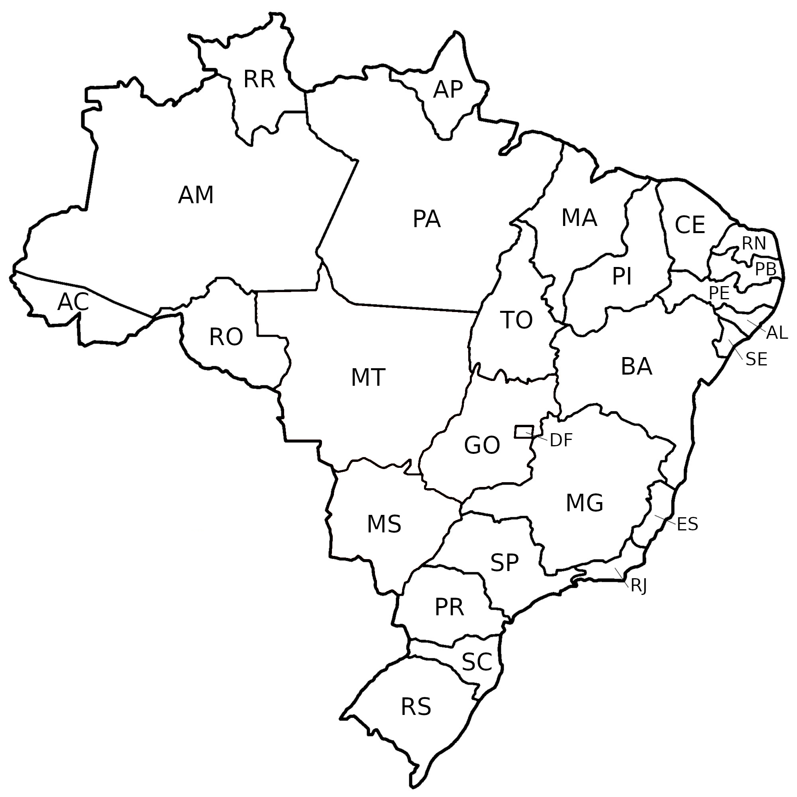

# Rotas

No caso de modal rodoviário, em que existir pelo menos um estado (UF) entre a UF de carregamento e a UF de descarregamento (por exemplo, manifesto com carregamento em GO e descarregamento em MA), o percurso deve ser informado, conforme a regra abaixo.

## Regra de Negócio

| #    | Regra de Validação                   | Crítica   | Msg   | Efeito |
| ---- | ------------------------------------ | --------- | ----- | ------ |
| G076 | Se modal Rodoviário, o grupo de informações de UF de percurso deverá ser preenchido na ordem Origem - Destino sempre que existir pelo menos uma UF entre a UF de carregamento e UF de descarregamento. <br/><br/> **Observação: ** A regra será aplicada considerando as divisas possíveis na ordem definida para o percurso. | Obrig. | 663 | Rej. |

Sendo assim, no caso exemplificado acima, seria necessário preencher os campos `<infPercurso>`, como o leiaute os define:

| #   | Campo       |  Descrição                                              | Ocorr.  | Tamanho    | Observações    |
| --- | ----------- | ------------------------------------------------------- | ------- | ---------- | -------------- |
| 24  | infPercurso | Informações do Percurso do MDF-e                        | 0 - 25  |            |                |
| 25  | &nbsp;&nbsp;&nbsp;&nbsp;&nbsp;UFPer    | Sigla das Unidades da Federação do percurso do veículo. | 1 - 1   | 2          | Não é necessário repetir as UF de Início e Fim |

:::note Observação
Os campos do Leiaute que não são importantes para essas anotações foram removidos da tabela acima.
:::

Existe, como observação, a informação de que não é necessário repetir as UF de Início e Fim e repetir as mesmas pode, inclusive, gerar mesma rejeição. Por exemplo, no caso de um manifesto saindo de GO até PI passando por TO e BA teriam os dados do XML preenchidos parecido com:

```xml
<MDFe xmlns="http://www.portalfiscal.inf.br/mdfe">
    <infMDFe versao="3.00" id="MDFe...">
        <ide>
            <!-- ... -->
            <UFIni>GO</UFIni>
            <UFFim>PI</UFFim>
            <infPercurso>
                <UFPer>TO</UFPer>
            </infPercurso>
            <infPercurso>
                <UFPer>BA</UFPer>
            </infPercurso>
            <!-- ... -->
        </ide>
        <!-- ... -->
    </infMDFe>
</MDFe>
```

## Validação

Assim, a rota para o transporte seria `GO -> TO -> BA -> PI`. Dentro desse contexto, faz sentido, por exemplo, se antecipar a SEFAZ e validar a rota inserida. Vejamos um exemplo (com auxilio do mapa abaixo):

1. Validar as UF's que fazem divisa com GO (`['MS', 'MT', 'TO', 'BA', 'DF', 'MG']`). TO está devidamente na lista.
2. Validar as UF's que fazem divisa com TO (`['MT', 'PA', 'MA', 'PI', 'BA', 'GO']`). BA está devidamente na lista.
3. Validar as UF's que fazem divisa com BA (`['TO', 'PI', 'PE', 'AL', 'SE', 'ES', 'MG', 'GO']`). PI está devidamente na lista.
4. Vejamos que PI não é necessário nenhuma validação pois é o fim do percurso.



Um algoritmo pode ser, de forma simples, implementado para executar essa validação antes do envio, de fato, do documento para a SEFAZ.

## Referências

- [Leiaute - Portal do Manifesto Eletrônico de Documentos Fiscais - SVRS](https://dfe-portal.svrs.rs.gov.br/Mdfe/Documentos#)

