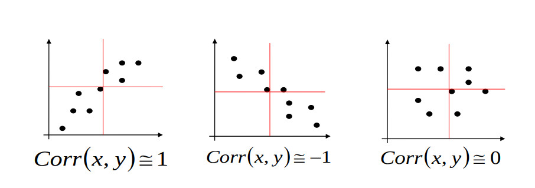

---
tags:
  - Estatística
  - Correlação
---

# Correlação

É uma medida adimensional que está entre $-1$ e $1$ e mede a relação entre duas variáveis;

:::info Correlação Positiva
Uma correlação positiva indica relacionamento diretamente proporcional, ou seja: quando o valor de uma variável aumenta, o da outra também.
:::

:::info Correlação Negativa
Uma correlação positiva indica relacionamento inversamente proporcional, ou seja: quando o valor de uma variável aumenta, o da outra diminui.
:::
