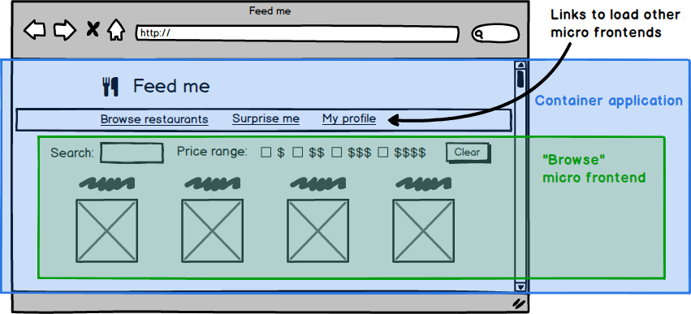

## Características

A arquitetura de micro front-ends traz uma ideia parecida com microserviços para o front-end, com algumas características:

- Maior independência entre os módulos;
- Arquitetura mais agnóstica a frameworks;
- Lógica pulverizada em vários projetos;
- Pipeline de build, test e deploys mais rápida;
- Assim como a arquitetura de micro serviços, adiciona uma complexidade a mais no projeto.

Os micro front-ends podem ser definidos, em [1], como:

> "An architectural style where independently deliverable frontend applications are composed into a greater whole"

---

## Exemplo Ilustrado

| Wireframe                               | Micro front-end                            |
| --------------------------------------- | ------------------------------------------ |
|  |  |

---

## Micro front-end's devem ter:

- Baixo ou nenhum acoplamento entre os micro front-ends;
- Alta coesão;
- Não deve assumir responsabilidades de outro micro front-end;
- Não deve interferir ou ser interferido por outro micro front-end;
- Base de código independente;
- Pipeline de build, test e deploy separados e independentes.
- Times autônomos.

import imageDeployment from './images/mf_deployment.png';

  
Pipeline de build, test e deploy separados e independentes

  

    
  

import imageAutonomous from './images/mf_horizontal.png';

  
Times autônomos

  

    
  

## Referências

- [Micro Frontends](https://martinfowler.com/articles/micro-frontends.html)
