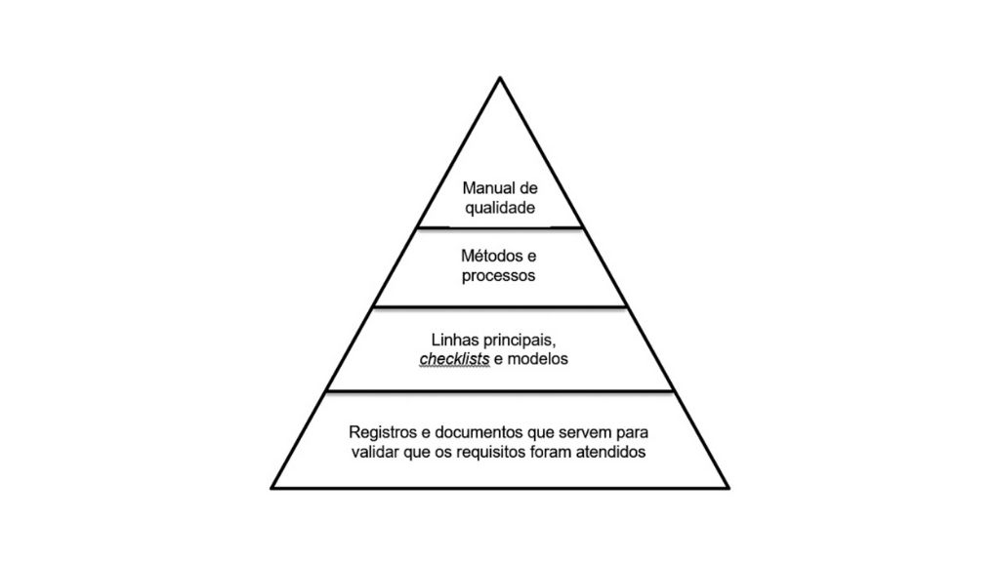

# Gestão da qualidade do software

- **ISO 9001- 00**

---

## Fatores da qualidade

- **corretude**: capacidade do software em executar suas funcionalidades conforme elas foram definidas. Se pudéssemos resumir esse fator em uma pergunta, ela seria próxima de: “o software faz aquilo que eu quero?” 
- **eficiência**: relaciona-se ao grau de adequação do programa aos recursos de hardware, tais como processador e memória. Eficiência é uma palavra muito comumente usada, embora muitas vezes de forma incorreta. Para ele, eficiência é a medida de quantos recursos são usados para que uma tarefa seja completada. Atualmente, com o hardware custando tão pouco, não se presta muita atenção no fator eficiência como no passado, exceto em processos que incluem quantidade muito grande de dados, como o Big Data, por exemplo (SHAFFER, 2013).
- **usabilidade**: este fator está relacionado com a facilidade de uso do produto. Em outras palavras, trata-se da medida da capacidade do público-alvo em obter valor do software por meio da sua interface.
- **portabilidade**: é possível usá-lo em outra plataforma? Trata-se da medida de facilidade em mudar o software de uma plataforma (Windows, por exemplo) para outra (Mac, por exemplo).
- **interoperabilidade**: trata-se da “capacidade de diversos sistemas e organizações trabalharem em conjunto (interoperar) de modo a garantir que pessoas, organizações e sistemas computacionais interajam para trocar informações de maneira eficaz e eficiente”. 

---

De acordo com Moorthy (2013), um sistema de gestão de qualidade de software deve possuir 4 níveis: o nível 1 é composto pelo manual de qualidade da empresa; o nível 2 refere-se aos métodos e processos usados pela equipe para entregar suas tarefas; o nível 3 contém as linhas principais, os checklists e os modelos, usados com bastante frequência no dia a dia e importantes na manutenção da consistência das informações e, por fim, o nível 4 refere-se aos registros e documentos usados para fins de validação de um produto, usados como evidências de uma atividade e úteis para referência futura. A figura abaixo mostra a organização dos níveis de um sistema de gestão de qualidade. 

---

Pois bem, um processo específico de gestão de software é definido no padrão IEEE 12207.0-96 e inclui o Processo de garantia da qualidade, mais conhecido pela abreviatura SQA (Software Quality Assurance ou Garantia da Qualidade do Software). 

