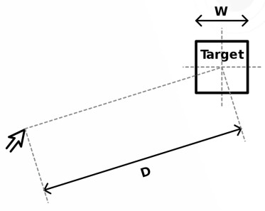

---
tags:
    - Design
    - UI
    - UX
    - Fitt's
---

# Lei de Fitt's

A lei de Fitt's afirma que o tempo necessário para executar uma ação é uma função da **distância** e **tamanho** do componente. Quanto maior a distância e menor o tamanho do componente, mais tempo leva para que a ação seja executada.

